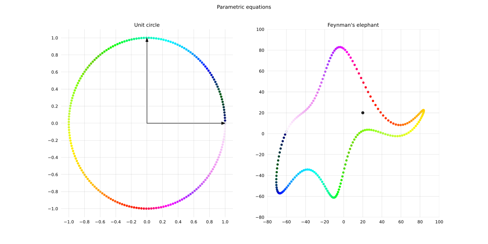
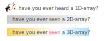
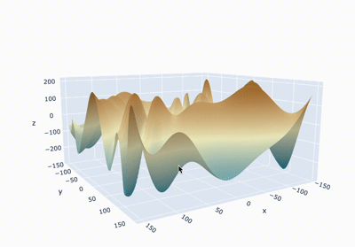
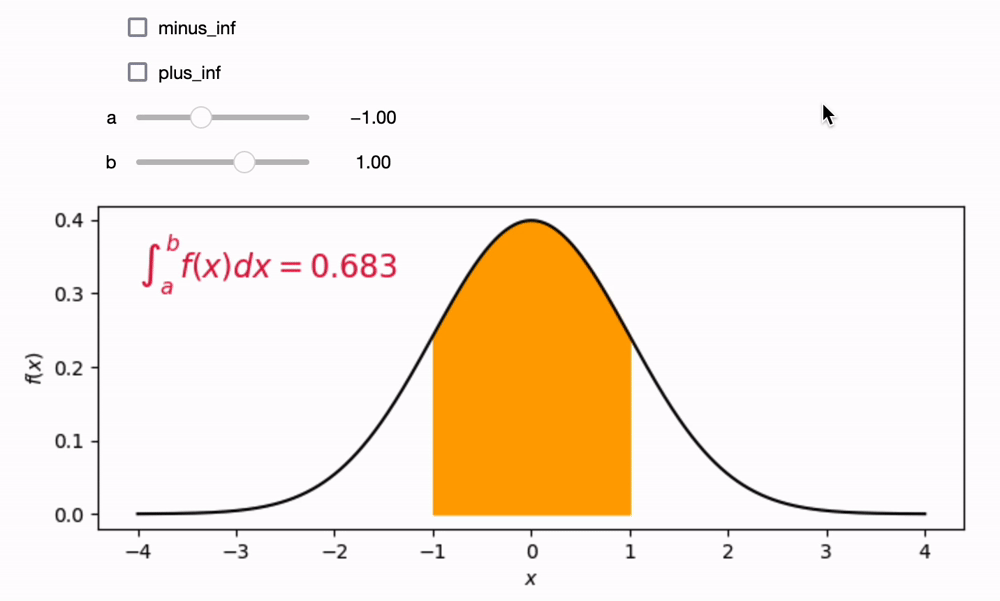

## Gallery










Tips:
- generate `GIF` with `PIL` 
- convert screencast movie into `GIF` with `ffmpeg` ([source and explanations](https://superuser.com/a/1502163)) 
```bash
~/programs/ffmpeg -i Integral.mov -filter_complex "[0:v] fps=12,scale=1000:-1,split [a][b];[a] palettegen [p];[b][p] paletteuse" Integral.gif
```
